# Project Continuum (AI Work Continuity & Agent Handoff System)

[](LICENSE)
[](https://www.python.org/downloads/)
[](tests/)

Continuum is a portable, mathematically verifiable, and model-independent AI work continuity engine designed to preserve the physical truth of an ongoing software engineering project across different AI models, sessions, and platforms.

---

## 🚀 The Core Problem & Solution

Current AI coding workflows suffer from **context entrapment** and **hallucination propagation**. When a developer switches models (e.g. Claude to GPT-4o to Gemini to Local Llama) or context windows reset, conversational summaries distort reality by turning unverified chat claims into false progress.

**Project Continuum solves this fundamentally:**
> **"Physical project reality must always be kept separate from conversational claims."**

Continuum does not recreate old conversations; it reconstructs the verifiable physical reality resulting from ongoing work.

---

## 🏛️ The Three-State Separation Architecture

Continuum maintains strict ontological separation between three distinct realities:

```mermaid
graph TD
    subgraph "Project State (Physical Reality)"
        A1[Source Code & Files]
        A2[AST Symbols & Types]
        A3[Manifests & Dependencies]
        A4[Git Tree & Churn]
        A5[Test & Build Results]
    end

    subgraph "Conversational State (Intent & Reasoning)"
        B1[User Requirements]
        B2[Architectural Decisions]
        B3[Agent Claims / Assertions]
        B4[Assumptions & Unresolved Qs]
    end

    subgraph "Agent Execution State (Tactical In-Flight)"
        C1[Active Tactical Tasks]
        C2[In-Flight File Edits]
        C3[Transient Errors]
        C4[Next Action Recommendation]
    end

    A1 & A2 & A3 & A4 & A5 --> D[Canonical Project State Root]
    B1 & B2 & B3 & B4 --> D
    C1 & C2 & C3 & C4 --> D
```



---

## ⚖️ The Evidence Hierarchy Matrix

When evidence conflicts, Continuum arbitrates truth according to strict seniority:

1. **Level 1 (Highest)**: Runtime status & automated test execution exit codes (`TEST_RUN`, `BUILD_LOG`, `RUNTIME_LOG`).
2. **Level 2**: AST syntax trees, symbol exports, physical manifests (`SOURCE_CODE`, `AST_SYMBOL`, `CONFIG_FILE`).
3. **Level 3**: Git working tree diffs, staged index, commit history (`GIT_COMMIT`, `GIT_DIFF`, `GIT_STATUS`).
4. **Level 4**: Architecture documentation, comments, READMEs (`DOCUMENTATION`).
5. **Level 5 (Lowest)**: Conversational statements and AI agent claims (`CONVERSATION_ASSERTION`, `USER_REQUIREMENT`, `AGENT_CLAIM`).

---

## 🗺️ Roadmap & Phase Progress to v1.0.0

| Milestone | Phase | Title | Status |
| :--- | :---: | :--- | :---: |
| **Milestone 1** | **Phase 0** | Architecture, Canonical Ontology & Schema Foundation | ✅ **VERIFIED** |
| **Milestone 2** | **Phase 1** | Workspace & Source Code Evidence Extraction | ✅ **VERIFIED** |
| | **Phase 2** | Configuration, Environment & Metadata Extraction | ✅ **VERIFIED** |
| | **Phase 3** | Git History & Workspace Delta Analysis | ✅ **VERIFIED** |
| | **Phase 4** | Test, Build & Verification Evidence Collection | ✅ **VERIFIED** |
| | **Phase 5** | Conversation & Agent State Ingestion | ✅ **VERIFIED** |
| **Milestone 3** | **Phase 6** | Evidence Resolution Engine | ✅ **VERIFIED** |
| | **Phase 7** | Contradiction Detection Engine | ✅ **VERIFIED** |
| | **Phase 8** | Confidence Calculation & Verified Status Evaluation | ⏳ *Next Phase* |
| **Milestone 4** | **Phase 9** | State Graph (DAG) Construction | ⏳ *Pending* |
| | **Phase 10** | Dependency Invalidation & Status Propagation | ⏳ *Pending* |
| | **Phase 11** | Graph Persistence, Querying & Visualization | ⏳ *Pending* |
| **Milestone 5** | **Phase 12** | Task-Driven Context Selection | ⏳ *Pending* |
| | **Phase 13** | Context Pruning & Token Budget Optimization | ⏳ *Pending* |
| **Milestone 6** | **Phase 14** | Universal Handoff Package Generation | ⏳ *Pending* |
| | **Phase 15** | Model-Specific Handoff Adapters (Claude, Codex, Gemini) | ⏳ *Pending* |
| **Milestone 7** | **Phase 16** | Filesystem Observation & Incremental State Updates | ⏳ *Pending* |
| | **Phase 17** | Git Hooks & Persistent State Management | ⏳ *Pending* |
| | **Phase 18** | Continuum Daemon & CLI | ⏳ *Pending* |
| **Milestone 8** | **Phase 19** | End-to-End Integration & Polyglot Validation | ⏳ *Pending* |
| | **Phase 20** | Adversarial Testing & Hallucination Resistance | ⏳ *Pending* |
| | **Phase 21** | Performance, Reliability & Data Integrity | ⏳ *Pending* |
| | **Phase 22** | Security, Privacy & Production Hardening | ⏳ *Pending* |
| | **Phase 23** | Documentation, Packaging & v1.0.0 Release | ⏳ *Pending* |

---

## 📂 Repository Structure

```text
CONTINUUM/
├── core/                        # Foundation & Canonical State (Phase 0)
│   ├── enums.py                 # Statuses, EvidenceTypes, EvidenceLevels, NodeTypes
│   ├── evidence.py              # Canonical Evidence & SHA-256 Provenance tracking
│   ├── state_models.py          # ProjectState, ConversationalState, AgentExecutionState
│   ├── interfaces.py            # Contracts for Extractors, Resolvers, Graph & Adapters
│   ├── schema.py                # JSON Schema generator & validation
│   └── serializer.py            # Deterministic, atomic JSON persistence
├── extractors/                  # Multi-Source Evidence Harvesters (Milestone 2)
│   ├── base.py                  # Base extractor & standard ignore filters
│   ├── workspace_extractor.py   # Phase 1: Workspace & language analysis
│   ├── config_extractor.py      # Phase 2: Manifests, lockfiles & container configs
│   ├── git_extractor.py         # Phase 3: Git status, branch, HEAD, churn & commit logs
│   ├── verification_extractor.py # Phase 4: Safe test & build execution (Level 1)
│   ├── conversation_extractor.py # Phase 5: Transcripts & claims ingestion (Level 5)
│   ├── config/
│   │   ├── parsers.py           # Multi-ecosystem manifest parsers
│   │   └── secret_sanitizer.py  # Zero-credential-leakage redaction engine
│   ├── parsers/
│   │   ├── base.py              # Parser protocol & result types
│   │   ├── python_parser.py     # Python AST class, method, function & export parser
│   │   ├── js_ts_parser.py      # JavaScript/TypeScript class, interface & type parser
│   │   └── comment_parser.py    # Universal TODO/FIXME/BUG marker extractor
│   └── verification/
│       └── runners.py           # Test runners & structured output parsers
├── resolution/                  # Truth Resolution & State Synthesis (Milestone 3)
│   └── resolver.py              # Phase 6: Seniority arbitration & conflict preservation
├── contradictions/              # Discrepancy & Hallucination Defense (Milestone 3)
│   ├── models.py                # ContradictionType, severity, and DiscrepancyLedger
│   └── detector.py              # Phase 7: Cross-boundary contradiction detector
├── tests/                       # Complete Test Suite (56 unit & integration tests)
│   ├── run_all_tests.py         # Test runner
│   ├── test_enums_and_evidence.py
│   ├── test_state_isolation.py
│   ├── test_serialization.py
│   ├── test_interfaces.py
│   ├── test_workspace_extractor.py
│   ├── test_config_extractor.py
│   ├── test_git_extractor.py
│   ├── test_verification_extractor.py
│   ├── test_conversation_extractor.py
│   ├── test_evidence_resolver.py
│   └── test_contradiction_detector.py
├── docs/reports/                # Phase Verification & Completion Reports
└── pyproject.toml
```

---

## 🧪 Running Tests

To run the complete Continuum test suite:

```bash
python tests/run_all_tests.py
# Or using the Windows Python launcher:
py tests/run_all_tests.py
```
