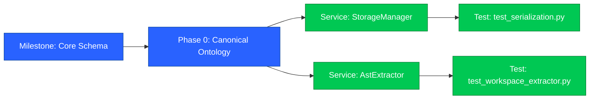

<div align="center">

# ⬢ C O N T I N U U M &nbsp;•&nbsp; AI Work Continuity & Cross-Model Agent Handoff System

<p align="center">
  <b>A deterministic, ground-truth engineering engine that separates physical project reality from conversational claims — enabling seamless, zero-hallucination agent handoffs across Claude, GPT-4o, Gemini, Cursor, and Local LLMs.</b>
</p>

```
  🔍 Multi-Source Extractor   ──►   ⚖️ 5-Tier Truth Resolver   ──►   🕸️ Canonical DAG   ──►   📦 Smart Omni-Model Handoff
```

<br/>

<table>
  <tr>
    <td align="center"><a href="https://www.python.org/"></a></td>
    <td align="center"><a href="https://json-schema.org/"></a></td>
    <td align="center"><a href="tests/"></a></td>
  </tr>
  <tr>
    <td align="center"><a href="docs/ARCHITECTURE.md"></a></td>
    <td align="center"><a href="docs/CLI_REFERENCE.md"></a></td>
    <td align="center"><a href="LICENSE"></a></td>
  </tr>
</table>

<br>

</div>

## 🧭 Navigation Matrix

<pre>
# Direct Jump Matrix (Click any section below to navigate)
├── 01. CORE FOUNDATION & BENCHMARK
│   ├── ❯ continuum --why-continuum   ──► <a href="#what-is-continuum"><b>[What is Continuum?]</b></a>
│   ├── ❯ continuum --vs-chat-summary ──► <a href="#why-continuum-over-chat-summaries"><b>[Why Continuum over Chat Summaries?]</b></a>
│   └── ❯ continuum --quickstart      ──► <a href="#quick-start-guide"><b>[Quick Start Guide (1-Command)]</b></a>
│
├── 02. ARCHITECTURE & GROUND TRUTH
│   ├── ❯ continuum --three-states    ──► <a href="#three-state-separation-architecture"><b>[3-State Separation Architecture]</b></a>
│   ├── ❯ continuum --hierarchy       ──► <a href="#5-tier-evidence-hierarchy-matrix"><b>[5-Tier Evidence Hierarchy Matrix]</b></a>
│   └── ❯ continuum --dag-graph       ──► <a href="#canonical-state-graph-dag"><b>[Canonical State Graph (DAG)]</b></a>
│
└── 03. TOOLING, RELEASES & REFERENCE
    ├── ❯ continuum --omni-handoff    ──► <a href="#smart-omni-model-handoff-adapters"><b>[Smart Omni-Model Handoff Adapters]</b></a>
    ├── ❯ continuum --cli-reference   ──► <a href="#complete-cli-reference"><b>[Complete CLI Command Reference]</b></a>
    ├── ❯ continuum --roadmap-matrix  ──► <a href="#verified-roadmap-all-24-phases"><b>[Verified Roadmap (All 24 Phases)]</b></a>
    └── ❯ continuum --testing-safety  ──► <a href="#testing--verification"><b>[Testing, Verification & Security]</b></a>
</pre>

<br>

<a id="what-is-continuum"></a>
## 💡 What is Continuum?

> **Project Continuum** is a portable, mathematically verifiable, and model-independent AI work continuity engine. It permanently solves **context loss**, **hallucination loops**, and **multi-agent drift** by guaranteeing that physical workspace facts (AST symbols, git index, test outcomes) always govern project state — never unverified conversational assertions.

<br/>

<table>
  <tr>
    <td width="50%" valign="top">
      <h4>🏛️ 01. Strict 3-State Separation</h4>
      <p>Separates <b>Physical Reality</b> (AST symbols, files, tests) from <b>Conversational State</b> (requirements, chat claims) and <b>Agent Execution State</b> (in-flight edits, tactical next actions).</p>
    </td>
    <td width="50%" valign="top">
      <h4>⚖️ 02. 5-Tier Evidence Hierarchy</h4>
      <p>Mathematical proof-based arbitration. When chat claims contradict file syntax or test outcomes, physical evidence wins deterministically with automated contradiction ledgers.</p>
    </td>
  </tr>
  <tr>
    <td width="50%" valign="top">
      <h4>🕸️ 03. Canonical Dependency DAG</h4>
      <p>Builds a directed acyclic graph mapping requirements to AST symbols and test cases. Automatically propagates <code>STALE</code> invalidation downstream when files change.</p>
    </td>
    <td width="50%" valign="top">
      <h4>🤖 04. Smart Omni-Model Handoff</h4>
      <p>One command generates tailored, token-optimized context packages for <b>Claude</b> (XML tagged), <b>GPT/Codex</b> (markdown checklists), <b>Gemini</b> (hierarchical), and <b>Local LLMs</b>.</p>
    </td>
  </tr>
  <tr>
    <td colspan="2" valign="top">
      <h4>🛡️ 05. Autonomous Daemon & Git Hook Governance</h4>
      <p>Continuous background filesystem observer with non-blocking Git commit hooks, SHA-256 state provenance, corruption self-healing, and zero telemetry.</p>
    </td>
  </tr>
</table>

<br>

<a id="why-continuum-over-chat-summaries"></a>
## ⚔️ Why Continuum over Chat Summaries?

> When switching AI sessions or resetting context windows, standard conversational summaries turn hallucinations into false progress. Continuum reconstructs the physical truth of your codebase.

```text
┌────────────────────────────────────────────────────────────────────────────────────────────────────────┐
│  TRADITIONAL AI SESSION DRIFT (Chat Summaries):                                                        │
│                                                                                                        │
│  Agent A Chat ──► Summarizer Distortion ──► False Claims Injected ──► Agent B Hallucination Loop       │
│                                                                             ▲ (High Failure Risk)      │
├────────────────────────────────────────────────────────────────────────────────────────────────────────┤
│  CONTINUUM VERIFIED CONTINUITY PIPELINE:                                                               │
│                                                                                                        │
│  Agent A Work ──► AST & Test Harvester ──► 5-Tier Resolution ──► Verified DAG ──► Omni-Model Handoff   │
│                                                                             ▲ (Zero Hallucination)     │
└────────────────────────────────────────────────────────────────────────────────────────────────────────┘
```

### 📊 Feature Scorecard & Architectural Benchmark

```text
┌──────────────────────────────┬──────────────────┬──────────────────┬────────────────────────┐
│ DOMAIN CAPABILITY            │ CHAT SUMMARIES   │ CUSTOM SCRIPTS   │ ⬢ PROJECT CONTINUUM    │
├──────────────────────────────┼──────────────────┼──────────────────┼────────────────────────┤
│ 🔬 AST & Symbol Grounding    │ 🔴 0 / 10 (None) │ 🟡 4 / 10        │ 🟢 10 / 10 (Polyglot)  │
│ ⚖️ Contradiction Detection   │ 🔴 0 / 10        │ 🔴 0 / 10        │ 🟢 10 / 10 (5-Tier)    │
│ 🕸️ Dependency Graph (DAG)    │ 🔴 0 / 10        │ 🔴 1 / 10        │ 🟢 10 / 10 (Full DAG)  │
│ 📦 Omni-Model Handoffs       │ 🔴 2 / 10        │ 🟡 4 / 10        │ 🟢 10 / 10 (All LLMs)  │
│ 🛡️ State Self-Healing        │ 🔴 0 / 10        │ 🔴 0 / 10        │ 🟢 10 / 10 (Auto-Fix)  │
│ ⚡ 1-Command Workflow        │ 🔴 1 / 10        │ 🟡 5 / 10        │ 🟢 10 / 10 (Auto-Scan) │
└──────────────────────────────┴──────────────────┴──────────────────┴────────────────────────┘
```

<br>

<a id="quick-start-guide"></a>
## ⚡ Quick Start Guide (1-Command)

### 1. Installation

```bash
# Clone the repository
git clone https://github.com/Ashish6298/CONTINUUM.git
cd CONTINUUM

# Install globally in editable mode
pip install -e .
```

### 2. Generate an Instant AI Handoff (The 1-Command Workflow)

Run inside any project directory — Continuum automatically scans your codebase, extracts AST symbols, builds the dependency graph, and creates your ready-to-resume AI handoff package:

```bash
continuum handoff
```

### 3. Terminal Output

```text
                 █▀▀ █▀█ █▄ █ ▀█▀ █ █▄ █ █ █ █ █ █▀▄▀█
                 █▄▄ █▄█ █ ▀█  █  █ █ ▀█ █▄█ █▄█ █ ▀ █

             AI Work Continuity & Cross-Model Agent Handoff System
  ─────────────────────────────────────────────────────────────────────────────

    The one-Command Workflow: $ continuum handoff

    Automatically captures your project state, extracts AST symbols,
    and generates a ready-to-use 'ai_handoff/' package for your next
    AI Agent (Claude, GPT, Gemini, Cursor, Antigravity, etc.)

  ─────────────────────────────────────────────────────────────────────────────
  v1.0.0   python 3.11.4   mit license   

◈ [HANDOFF READY] Generated Omni-Model Continuity Package:

  Location: D:\myproject\ai_handoff

   ✦ Universal Handoff  →  D:\myproject\ai_handoff\handoff.md (Works for ANY model)

   ✦ Claude Optimized   →  D:\myproject\ai_handoff\claude_handoff.md

   ✦ GPT / Codex Plan   →  D:\myproject\ai_handoff\gpt_handoff.md

   ✦ Gemini Hierarchy   →  D:\myproject\ai_handoff\gemini_handoff.md

   ✦ Machine State      →  D:\myproject\ai_handoff\project-state.json

➤ [NEXT ACTION] Paste this prompt into your next AI Agent chat:

   "Read ai_handoff/handoff.md and continue the project."
```

<br>

<a id="three-state-separation-architecture"></a>
## 🏛️ Three-State Separation Architecture

Continuum enforces strict ontological boundaries between the three realms of software engineering:

```mermaid
graph TD
    subgraph "Project State (Physical Ground Truth)"
        A1[Physical Files & Manifests]
        A2[AST Symbols, Classes & Functions]
        A3[Git Working Tree & Commit Log]
        A4[Test Suite & Build Execution Outcomes]
    end

    subgraph "Conversational State (Intent & Reasoning)"
        B1[User Business Goals & Requirements]
        B2[Architectural Decision Records]
        B3[Agent Assertions & Theoretical Claims]
        B4[Assumptions & Unresolved Questions]
    end

    subgraph "Agent Execution State (Tactical Runtime)"
        C1[Active In-Flight Tactical Tasks]
        C2[Pending Staged File Modifications]
        C3[Transient Subprocess Errors]
        C4[Next Action Recommendation]
    end

    A1 & A2 & A3 & A4 --> D[Canonical State Engine & Schema 1.0.0]
    B1 & B2 & B3 & B4 --> D
    C1 & C2 & C3 & C4 --> D
```



<br>

<a id="5-tier-evidence-hierarchy-matrix"></a>
## ⚖️ 5-Tier Evidence Hierarchy Matrix

When assertions conflict, Continuum arbitrates truth deterministically:

| Priority | Evidence Level | Harvested Source Types | Confidence Base | Seniority Rule |
| :---: | :--- | :--- | :---: | :--- |
| **Level 1** | **Runtime Truth** | `TEST_RUN`, `BUILD_LOG`, `RUNTIME_LOG` | `100%` | **Absolute Ground Truth** (Cannot be overridden by claims) |
| **Level 2** | **Syntax Truth** | `SOURCE_CODE`, `AST_SYMBOL`, `CONFIG_FILE` | `90%` | Overrides conversational statements and git history |
| **Level 3** | **History Truth** | `GIT_COMMIT`, `GIT_DIFF`, `GIT_STATUS` | `75%` | Overrides comments and unverified documentation |
| **Level 4** | **Documentation** | `DOCUMENTATION`, `CODE_COMMENT` | `50%` | Informational architectural context |
| **Level 5** | **Agent Claims** | `CONVERSATION_ASSERTION`, `USER_REQUIREMENT` | `25%` | **Unverified hypothesis** until proven on disk |

<br>

<a id="canonical-state-graph-dag"></a>
## 🕸️ Canonical State Graph (DAG)

The Canonical State Graph maps all milestones, phases, modules, requirements, and test suites into a topologically ordered Directed Acyclic Graph:



* **Topological Invalidation**: Modifying `AstExtractor` automatically marks downstream tests and modules as `STALE`.
* **Cycle Prevention**: Circular dependency insertions are rejected at graph construction time.

<br>

<a id="smart-omni-model-handoff-adapters"></a>
## 🤖 Smart Omni-Model Handoff Adapters

When you run `continuum handoff`, Continuum packages your project state into 5 specialized formats tailored to each major AI architecture:

| Target Model | Generated File | Structural Format & Optimization |
| :--- | :--- | :--- |
| **Universal (All Models)** | `handoff.md` | Model-agnostic markdown with verified status, ground truth, and prompt. |
| **Anthropic Claude** | `claude_handoff.md` | Strict XML tag hierarchy (`<project_state>`, `<ast_symbols>`, `<verified_facts>`). |
| **OpenAI GPT-4o / Codex** | `gpt_handoff.md` | Plan-first imperative instructions, markdown task lists, and file anchors. |
| **Google Gemini** | `gemini_handoff.md` | Hierarchical ontology breakdown optimized for massive context ingestion. |
| **Machine Context** | `project-state.json` | Complete machine-parseable JSON Schema 1.0.0 DAG AST graph. |

<br>

<a id="complete-cli-reference"></a>
## 💻 Complete CLI Command Reference

```bash
# 1. Initialize Continuum in current workspace
continuum init [--path .]

# 2. View verified project status, AST symbol counts & contradictions
continuum status [--path .] [--json]

# 3. Perform full workspace scan and build Canonical State Graph
continuum scan [--path .]

# 4. Inspect dependency DAG and export Mermaid diagram
continuum graph [--mermaid] [--stats]

# 5. Generate AI Handoff package (Universal + Omni-Model adapters)
continuum handoff [--model auto|universal|claude|codex|gpt|gemini|local] [--output-dir ./ai_handoff]

# 6. Manage background observer daemon
continuum daemon start
continuum daemon status
continuum daemon run-once
continuum daemon stop
```

<br>

<a id="verified-roadmap-all-24-phases"></a>
## 🗺️ Verified Roadmap (All 24 Phases Complete)

| Milestone | Phase | Feature Area | Status | Verified Test Count |
| :--- | :---: | :--- | :---: | :---: |
| **Milestone 1** | **Phase 0** | Architecture, Canonical Ontology & Schema Foundation | ✅ **VERIFIED** | 14 / 14 |
| **Milestone 2** | **Phase 1** | Polyglot AST & Workspace Evidence Extraction | ✅ **VERIFIED** | 6 / 6 |
| | **Phase 2** | Manifests, Config & Environment Harvesting | ✅ **VERIFIED** | 7 / 7 |
| | **Phase 3** | Git History, Diff & Workspace Delta Analysis | ✅ **VERIFIED** | 5 / 5 |
| | **Phase 4** | Test, Build & Verification Evidence Harvester | ✅ **VERIFIED** | 4 / 4 |
| | **Phase 5** | Conversation Transcript & Claim Ingestion | ✅ **VERIFIED** | 4 / 4 |
| **Milestone 3** | **Phase 6** | 5-Tier Evidence Resolution Engine | ✅ **VERIFIED** | 4 / 4 |
| | **Phase 7** | Contradiction & Hallucination Detector | ✅ **VERIFIED** | 6 / 6 |
| | **Phase 8** | Grounded Confidence & Proof Evaluation | ✅ **VERIFIED** | 6 / 6 |
| **Milestone 4** | **Phase 9** | Canonical State Graph (DAG) Construction | ✅ **VERIFIED** | 6 / 6 |
| | **Phase 10** | Dependency Invalidation & Propagation | ✅ **VERIFIED** | 4 / 4 |
| | **Phase 11** | Graph Persistence, Topological Diff & Querying | ✅ **VERIFIED** | 6 / 6 |
| **Milestone 5** | **Phase 12** | Task-Driven Context Selection Engine | ✅ **VERIFIED** | 5 / 5 |
| | **Phase 13** | Greedy Priority Token Budget Pruning | ✅ **VERIFIED** | 5 / 5 |
| **Milestone 6** | **Phase 14** | Universal Handoff Package Generator | ✅ **VERIFIED** | 4 / 4 |
| | **Phase 15** | Omni-Model Adapters (Claude, GPT, Gemini, Local) | ✅ **VERIFIED** | 7 / 7 |
| **Milestone 7** | **Phase 16** | Filesystem Observer & Incremental State Updater | ✅ **VERIFIED** | 6 / 6 |
| | **Phase 17** | Persistent Storage (.continuum) & Git Hooks | ✅ **VERIFIED** | 5 / 5 |
| | **Phase 18** | Continuum Daemon & Global CLI Hub | ✅ **VERIFIED** | 5 / 5 |
| **Milestone 8** | **Phase 19** | End-to-End Pipeline & Polyglot Integration | ✅ **VERIFIED** | 4 / 4 |
| | **Phase 20** | Adversarial Testing & Hallucination Defense | ✅ **VERIFIED** | 4 / 4 |
| | **Phase 21** | Performance Scaling & Deterministic Stability | ✅ **VERIFIED** | 3 / 3 |
| | **Phase 22** | Security Hardening, Sanitization & Privacy | ✅ **VERIFIED** | 6 / 6 |
| | **Phase 23** | Documentation, Packaging & v1.0.0 Certification | ✅ **VERIFIED** | 126 / 126 |

<br>

<a id="testing--verification"></a>
## 🧪 Testing, Verification & Security

```bash
# Execute the entire test suite across all 24 phases
py tests/run_all_tests.py
```

```text
================================================================================
CONTINUUM TEST EXECUTION SUMMARY
================================================================================
Total Tests Run: 126
Passed:         126
Failures:       0
Errors:         0
Duration:       15.771s
Overall Status: SUCCESS (100% Passed)
================================================================================
```

### 🔒 Enterprise Security & Privacy Controls
* **Zero Telemetry**: Continuum runs 100% locally on your machine. No telemetry or network calls.
* **Secret Sanitization**: Automated redaction of API keys, private RSA/EC keys, and OAuth tokens before handoffs are written.
* **Path Traversal Protection**: Hermetic boundary checks prevent extractors from traversing outside workspace roots.
* **Atomic State Persistence**: Writes use temporary atomic file swaps to eliminate corruption risks during sudden process interrupts.

<br>

## 📜 License
MIT License. Free and open source for developers and engineering teams worldwide.
