# Project Continuum v1.0.0 Architecture & Canonical Ontology

Continuum is built on the principle that **conversational claims must never be confused with physical project ground truth**.

---

## 1. The Three-State Separation Architecture

Continuum maintains three strictly isolated state realms:

```mermaid
graph TD
    subgraph "State 1: ProjectState (Physical Ground Truth)"
        A1[Physical Source Files]
        A2[AST Class/Function Symbols]
        A3[Package Manifests & Dependencies]
        A4[Git Tree & Churn Metrics]
        A5[Test Execution & Build Exit Codes]
    end

    subgraph "State 2: ConversationalState (Intent & Claims)"
        B1[User Requirements]
        B2[Architectural Decisions]
        B3[Unverified Agent Claims]
        B4[Assumptions & Questions]
    end

    subgraph "State 3: AgentExecutionState (In-Flight Work)"
        C1[Active In-Flight Tasks]
        C2[Unsaved / In-Flight File Edits]
        C3[Transient Errors]
        C4[Recommended Next Action]
    end

    A1 & A2 & A3 & A4 & A5 --> D[Canonical Project State Root]
    B1 & B2 & B3 & B4 --> D
    C1 & C2 & C3 & C4 --> D
```



---

## 2. Seniority & Evidence Arbitration Matrix

When evidence conflicts (e.g. an AI claims a feature is complete, but no files or tests exist), Continuum arbitrates truth according to five strict hierarchical levels:

| Seniority | Evidence Type | Primary Source | Trust Level | Overrules |
| :---: | :--- | :--- | :--- | :--- |
| **Level 1** | `TEST_RUN`, `BUILD_LOG` | Test runners, build tools, exit codes | **Highest (Empirical)** | Levels 2, 3, 4, 5 |
| **Level 2** | `AST_SYMBOL`, `SOURCE_CODE` | Codebase AST, parser symbol tables | **Strong (Physical)** | Levels 3, 4, 5 |
| **Level 3** | `CONFIG_FILE`, `MANIFEST` | `pyproject.toml`, `package.json`, lockfiles | **Moderate (Structural)** | Levels 4, 5 |
| **Level 4** | `GIT_COMMIT`, `GIT_STATUS` | Commit logs, diff stats, working tree status | **Contextual (Historical)** | Level 5 |
| **Level 5** | `AGENT_CLAIM`, `USER_REQ` | LLM dialogue turns, conversational assertions | **Unverified (Intent)** | None (Overruled by 1–4) |

---

## 3. Subsystem Architecture

```
                               ┌───────────────────────────┐
                               │     Target Workspace      │
                               └─────────────┬─────────────┘
                                             │
                       ┌─────────────────────┴─────────────────────┐
                       ▼                                           ▼
          ┌──────────────────────────┐                ┌──────────────────────────┐
          │ Physical Extractors      │                │ Conversation Extractor   │
          │ (Workspace, Config, Git, │                │ (Transcripts, Prompts,   │
          │ Verification)            │                │ Claims)                  │
          └────────────┬─────────────┘                └────────────┬─────────────┘
                       │                                           │
                       │ Level 1-4 Evidence                        │ Level 5 Evidence
                       └─────────────────────┬─────────────────────┘
                                             ▼
                               ┌───────────────────────────┐
                               │   Truth Resolution &      │
                               │  Contradiction Detection  │
                               └─────────────┬─────────────┘
                                             ▼
                               ┌───────────────────────────┐
                               │  Confidence Scoring &     │
                               │  Canonical Graph (DAG)    │
                               └─────────────┬─────────────┘
                                             │
                       ┌─────────────────────┴─────────────────────┐
                       ▼                                           ▼
          ┌──────────────────────────┐                ┌──────────────────────────┐
          │ Task Context Selector &  │                │ Storage Manager &        │
          │ Token Budget Pruner      │                │ Background Watcher       │
          └────────────┬─────────────┘                └──────────────────────────┘
                       ▼
          ┌──────────────────────────┐
          │ Universal & Model-       │
          │ Specific Handoff Adapters│
          │ (Claude, Codex, Gemini,  │
          │ Local LLM)               │
          └──────────────────────────┘
```
