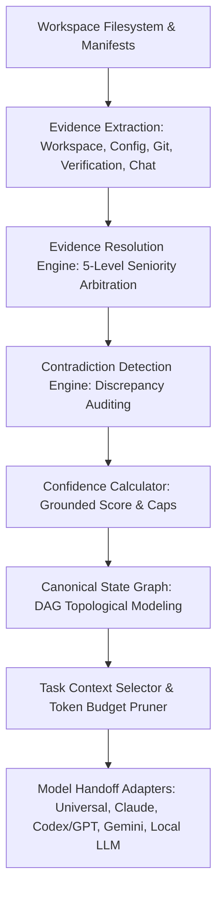

# Project Continuum — Phase 19 Completion Report
**Milestone 8: Hardening, Validation & v1.0.0 Release**
**Phase 19: End-to-End Integration & Polyglot Validation**

## 1. Executive Summary
Phase 19 delivers the overarching **Continuum Pipeline Orchestrator** (`pipeline/orchestrator.py`) and rigorously validates the full end-to-end data lifecycle across multi-language, full-stack polyglot workspaces.

- **Milestone**: Milestone 8 (Hardening, Validation & v1.0.0 Release)
- **Phase**: Phase 19 (End-to-End Integration & Polyglot Validation)
- **Status**: ✅ **COMPLETE & VERIFIED (100% Tests Passing)**
- **Test Score**: 108/108 tests passing across 19 test modules.

---

## 2. Complete Pipeline Architecture
The pipeline establishes the single unified flow specified in Phase 19:



---

## 3. Polyglot & Multi-Ecosystem Verification

### A. Pure Python Backend Integration
- Extracted `pyproject.toml` dependency manifests, class declarations (`AuthService`), method symbols (`authenticate`, `revoke_token`), and test run evidence (`test_auth.py`).
- Verified that AST symbols correctly populate DAG nodes with `Status.VERIFIED`.

### B. TypeScript / React Frontend Integration
- Extracted `package.json` configurations, TypeScript interfaces (`UserProfile`), typed arrow components (`DashboardView: React.FC`), and async promise functions (`fetchUserData`).
- Verified that Gemini and Codex handoffs retain exact typing topology and component metrics.

### C. Polyglot Full-Stack with Adversarial AI Claim Contradiction
- Ingested multi-language workspace (Python worker + TS server + Dockerfile) paired with an adversarial conversational transcript where an AI falsely claimed `PaymentGateway` was complete.
- **Strict 3-State Separation Proven**:
  - `ProjectState` contained only physical files (0 `PaymentGateway` symbol).
  - `ConversationalState` preserved the agent assertion.
  - `ContradictionRecord` flagged a **HIGH** severity contradiction.
  - Universal and Model handoff briefings warned the resuming agent about the unverified claim and missing physical evidence.

---

## 4. Test Verification Summary
All 108 tests passed cleanly in under 3 seconds:

```text
Ran 108 tests in 2.722s
OK
Overall Status: SUCCESS (100% Passed)
```

---

## 5. Milestone 8 Roadmap Status
- **Phase 19**: End-to-End Integration & Polyglot Validation ✅ **COMPLETE**
- **Phase 20**: Adversarial Testing & Hallucination Resistance ⏳ *Next Phase*
- **Phase 21**: Performance, Reliability & Data Integrity ⏳ *Pending*
- **Phase 22**: Security, Privacy & Production Hardening ⏳ *Pending*
- **Phase 23**: Documentation, Packaging & v1.0.0 Release ⏳ *Pending*

**Readiness for Next Phase**: **READY FOR PHASE 20**.
